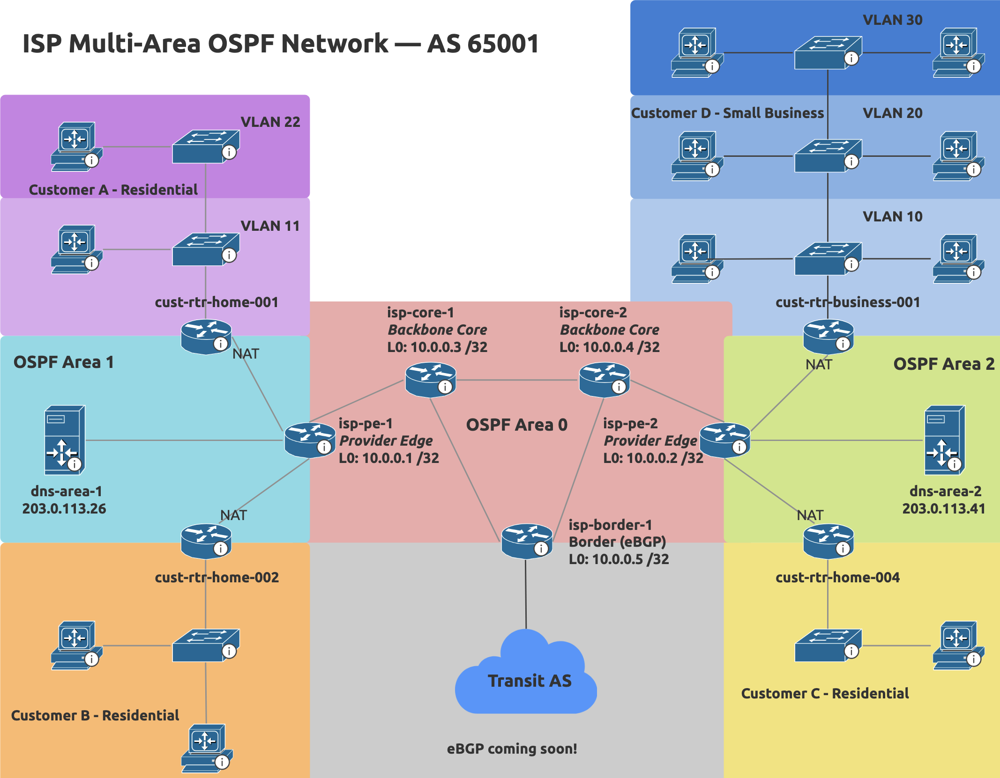

# ISP Multi-Area OSPF Lab

A simulated ISP network in Cisco Packet Tracer demonstrating multi-area OSPF, hierarchical addressing, and customer-edge service delivery across two access regions.

The lab models a single autonomous system (AS 65001) partitioned into three OSPF areas — one backbone (Area 0) and two customer-access areas — serving four subscribers including a small business with multiple VLANs. Provider Edge routers act as Area Border Routers. The border router is reserved for eBGP in Phase 3.

## Skills demonstrated

| Capability | Evidence |
|---|---|
| IP networking fundamentals | [Addressing plan](docs/ip-addressing-plan.md) — VLSM, /30 links, /32 loopbacks, RFC1918 vs. public space |
| Application of IP protocols | OSPF, DNS, NAT/PAT, VLAN, inter-VLAN routing — see [configs](configs/) |
| Network analysis & troubleshooting | [Verification](docs/verification.md) — adjacencies, routing tables, end-to-end paths, convergence demo |
| Major routing protocols | [OSPF design](docs/ospf-design.md) — multi-area architecture; eBGP planned for Phase 3 |
| Cisco IOS | Full running-configs in [`configs/`](configs/) |
| Automation | Python config templating planned for Phase 4 |

## Repository contents

- [`docs/`](docs/) — topology diagram, addressing plan, OSPF design rationale, verification outputs
- [`configs/`](configs/) — Cisco IOS running-configs for every device, plus a [config cheat sheet](configs/config-cheat-sheet.md)
- [`packet-tracer/`](packet-tracer/) — the live `.pkt` file (Cisco Packet Tracer 8.x)

## License

[MIT](LICENSE)